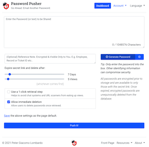
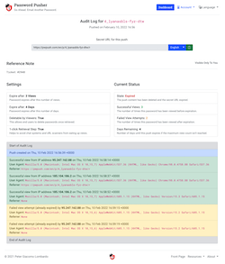
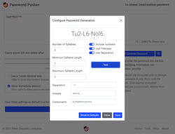
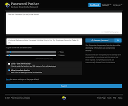
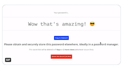

<div align="center">


__Simple & Secure Password Sharing with Auto-Expiration of Shared Items__
    
[](https://twitter.com/pwpush)


[](https://hub.docker.com/repositories)

[](https://github.com/pglombardo/PasswordPusher/actions/workflows/ruby.yml)
[](https://circleci.com/gh/pglombardo/PasswordPusher/tree/master)
[](https://github.com/pglombardo/pwpush-cli/pulls?utf8=%E2%9C%93&q=is%3Apr%20author%3Aapp%2Fdependabot)
[](https://github.com/pglombardo/pwpush-cli/releases)
[](https://github.com/pglombardo/pwpush/blob/master/LICENSE)

</div>

------

Password Pusher is an opensource application to communicate passwords over the web. Links to passwords expire after a certain number of views and/or time has passed.

Hosted at [pwpush.com](https://pwpush.com) but you can also easily run your own private instance with just a few steps.

* __Easy-to-install:__ Host your own via Docker, a cloud service or just use [pwpush.com](https://pwpush.com)
* __Opensource:__ No blackbox code.  Only trusted, tested and reviewed opensource code.
* __Audit logging:__ Track and control what you've shared and see who has viewed it.
* __Encrypted storage:__ All sensitive data is stored encrypted and is deleted once expired.
* __Host your own:__ Database backed or ephemeral, easily run your own instance isolated from the world.
* __JSON API:__ Raw JSON API available for 3rd party tools or command line via `curl` or `wget`.
* __Command line interface:__ Automate your password distribution with CLI tools or custom scripts.
* __Internationalized:__ 14 language translations are bundled in.  Easily selectable via UI or URL
* __Unbranded delivery page:__ No logos, superfluous text or unrelated links to confuse end users.
* __Customizable:__ Change text and default options via environment variables.
* __Light & dark themes:__  Via CSS @media integration, the site theme follows your local preferences
* __Rebrandable:__ Customize the site name, tagline and logo to fit your environment.
* __10 Years Old:__ Password Pusher has securely delivered millions and millions of passwords in it's 10 year history.
* __Honest Software:__  Opensource written and maintained by [me](https://github.com/pglombardo) with the help of some great contributors.  No organizations, corporations or evil agendas.

Follow Password Pusher [on Twitter](https://twitter.com/pwpush), [Gettr](https://gettr.com/user/pwpush) or [on Facebook](https://www.facebook.com/pwpush) for the latest news, updates and changes.

-----

[](./app/frontend/img/features/front-page-large.png)
[](./app/frontend/img/features/audit-log-large.png)
[](./app/frontend/img/features/secret-url-languages-large.png)
[](./app/frontend/img/features/password-generator-large.png)
[](./app/frontend/img/features/dark-theme.gif)
[](./app/frontend/img/features/preliminary-step.gif)


# Quickstart

→ Go to [pwpush.com](https://pwpush.com) and try it out.

_or_

→ Run your own instance with one command: `docker run -d -p "5100:5100" pglombardo/pwpush-ephemeral:release` then go to http://localhost:5100

_or_

→ Use one of the [3rd party tools](#3rd-party-tools) that interface with Password Pusher.

# 💾 Run Your Own Instance

_Note: Password Pusher can be largely configured by environment variables so after you pick your deployment method below, make sure to read [the configuration page](Configuration.md).  Take particular attention in setting your own custom encryption key which isn't required but provides the best security for your instance._

## On Docker

Docker images of Password Pusher are available on [Docker hub](https://hub.docker.com/u/pglombardo).

**➜ ephemeral**
_Temporary database that is wiped on container restart._

    docker run -d -p "5100:5100" pglombardo/pwpush-ephemeral:release

[Learn more](https://github.com/pglombardo/PasswordPusher/tree/master/containers/docker#pwpush-ephemeral)

**➜ using an External Postgres Database**
_Postgres database backed instance._

    docker run -d -p "5100:5100" pglombardo/pwpush-postgres:release

[Learn more](https://github.com/pglombardo/PasswordPusher/tree/master/containers/docker#pwpush-postgres)

**➜ using an External MariaDB (MySQL) Database**
_Mariadb database backed instance._

    docker run -d -p "5100:5100" pglombardo/pwpush-mysql:release

[Learn more](https://github.com/pglombardo/PasswordPusher/tree/master/containers/docker#pwpush-mysql)

_Note: The `latest` Docker container tag builds nightly off of the latest code changes and can occasionally be unstable.  Always use the ['release' or version'd tags](https://hub.docker.com/repository/docker/pglombardo/pwpush-ephemeral/tags?page=1&ordering=last_updated) if you prefer more stability in releases._

## With Docker Compose

**➜ One-liner Password Pusher with a Postgres Database**

    curl -s -o docker-compose.yml https://raw.githubusercontent.com/pglombardo/PasswordPusher/master/containers/docker/pwpush-postgres/docker-compose.yaml && docker compose up -d

**➜ One-liner Password Pusher with a MariaDB (MySQL) Database**

    curl -s -o docker-compose.yml https://raw.githubusercontent.com/pglombardo/PasswordPusher/master/containers/docker/pwpush-mysql/docker-compose.yaml && docker compose up -d

## On Kubernetes

Instructions and explanation of a Kubernetes setup [can be found
here](https://github.com/pglombardo/PasswordPusher/tree/master/containers/kubernetes).

## On Microsoft Azure

_There used to be a 3rd party blog post with instructions but it's been deleted.  If anyone has instructions they would like to contribute, it would be greatly appreciated._

See [issue #277](https://github.com/pglombardo/PasswordPusher/issues/277)

## On OpenShift

See our [OpenShift documentation](https://github.com/pglombardo/PasswordPusher/tree/master/containers/docker#pwpush-openshift).

## On Heroku

One click deploy to [Heroku Cloud](https://www.heroku.com) without having to set up servers.

[](https://heroku.com/deploy?template=https://github.com/pglombardo/PasswordPusher)

_This option will deploy a production Password Pusher instance backed by a postgres database to Heroku.  As is monthly cost: $0._

## From Source

Make sure you have git and Ruby installed and then:

```sh
git clone git@github.com:pglombardo/PasswordPusher.git
cd PasswordPusher
gem install bundler
bundle install --without development production test --deployment
bundle exec rake assets:precompile
RAILS_ENV=private ./bin/rake db:setup
./bin/rails server --environment=private
```

Then view the site @ [http://localhost:5100/](http://localhost:5100/).

# 3rd Party Tools

## Command Line Utilities

* [pgarm/pwposh](https://github.com/pgarm/pwposh): a PowerShell module available in the [PowerShell Gallery](https://www.powershellgallery.com/packages/PwPoSh/)

*  [kprocyszyn/Get-PasswordLink.ps1](https://github.com/kprocyszyn/tools/blob/master/Get-PasswordLink/Get-PasswordLink.ps1): a PowerShell based CLI

*  [lnfnunes/pwpush-cli](https://github.com/lnfnunes/pwpush-cli): a Node.js based CLI 

* [abkierstein/pwpush](https://github.com/abkierstein/pwpush): a Python based CLI

## Libraries & APIs

* [oyale/PwPush-PHP](https://github.com/oyale/PwPush-PHP): a PHP library wrapper to easily push passwords to any Password Pusher instance

## Android Apps

*  [Pushie](https://play.google.com/store/apps/details?id=com.chesire.pushie) by [chesire](https://github.com/chesire)

## Application Integrations

* [Slack: How to Add a Custom Slash Command](https://github.com/pglombardo/PasswordPusher/wiki/PasswordPusher-&-Slack:-Custom-Slash-Command)

* [Unraid Application](https://forums.unraid.net/topic/104128-support-passwordpusher-pwpush-corneliousjd-repo/)

* [Alfred Workflow](http://www.packal.org/workflow/passwordpusher) for Mac users

# The Password Pusher API

* [JSON API](https://github.com/pglombardo/PasswordPusher/wiki/Password-API)

# Internationalization

Password Pusher is currently available in **14 languages** with more languages being added often as volunteers apply.

From within the application, the language is selectable from a language menu.  Out of the box and before any language menu selection is done, the default language for the application is English.

## Changing the Default Language

The default language can be changed by setting an environment variable with the appropriate language code:

    PWP__DEFAULT_LOCALE=es

For more details, a list of supported language codes and further explanation, see the bottom of this [configuration file](https://github.com/pglombardo/PasswordPusher/blob/master/config/settings.yml).

# 📼 Credits

## Translators

Thanks to our great translators!

If you would like to volunteer and assist in translating, see [this page](https://pwpush.com/en/pages/translate).

* Catalan
  * [Oyale](https://github.com/oyale)

* Danish
  * Finn Skaaning

* French
  * [Thibaut](https://github.com/tibo59)

* German
  * Thomas Wölk: [Github](https://github.com/confluencepoint/) | [Twitter](https://twitter.com/confluencepoint)
  * Martin Otto

* Norwegian
  * Robin Jørgensen

* Polish
  * [Łukasz](https://github.com/drpt)

* Portuguese
  * [Jair Henrique](https://github.com/jairhenrique/)
  * [Fabrício Rodrigues](https://www.linkedin.com/in/ifabriciorodrigues/)
  * [Ivan Freitas](https://github.com/IvanMFreitas)
  * Sara Faria

* Spanish
  * [Oyale](https://github.com/oyale)

* Swedish
  * johan323
  * Fredrik Arvas

Also thanks to [translation.io](https://translation.io) for their great service in managing translations.  It's also generously free for opensource projects.

## Containers

Thanks to:

* [@fiskhest](https://github.com/fiskhest) the [Kubernetes installation instructions and manifests](https://github.com/pglombardo/PasswordPusher/tree/master/containers/kubernetes).

* [@sfarosu](https://github.com/sfarosu) for [contributing](https://github.com/pglombardo/PasswordPusher/pull/82) the Docker, Kubernetes & OpenShift container support.

## Other

Thanks to:

* [@iandunn](https://github.com/iandunn) for better password form security.

* [Kasper 'kapöw' Grubbe](https://github.com/kaspergrubbe) for the [JSON POST fix](https://github.com/pglombardo/PasswordPusher/pull/3).

* [JarvisAndPi](http://www.reddit.com/user/JarvisAndPi) for the favicon design

...and many more.  See the [Contributors page](https://github.com/pglombardo/PasswordPusher/graphs/contributors) for more details.
