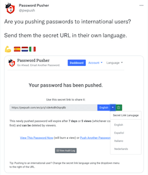
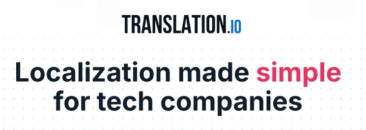

<div align="center">

[](https://pwpush.com/)

__Share sensitive information securely (files too!) with self-deleting links & full audit logs.__

[](https://twitter.com/pwpush)

[](https://stats.uptimerobot.com/6xJjNtPr93)
[](https://hub.docker.com/repositories)

[](https://github.com/pglombardo/PasswordPusher/actions/workflows/ruby-tests.yml)
[](https://github.com/pglombardo/pwpush-cli/pulls?utf8=%E2%9C%93&q=is%3Apr%20author%3Aapp%2Fdependabot)
[](https://github.com/pglombardo/pwpush-cli/releases)
[](https://github.com/pglombardo/PasswordPusher/blob/master/LICENSE)

</div>

------

Give your users the tools to be secure by default.

Password Pusher is an open source application to communicate sensitive information over the web. Secret links expire after a certain number of views and/or time has passed.

Hosted at [pwpush.com](https://pwpush.com) but you can also easily run your own private instance with just a few steps.

* __Easy-to-install:__ Host your own via Docker, a cloud service or just use [pwpush.com](https://pwpush.com)
* __Open Source:__ No blackbox code.  Only trusted, tested and reviewed open source code.
* __Versatile:__ Push passwords, text, files or URLs that auto-expire and self delete.
* __Audit logging:__ Track and control what you've shared and see who has viewed it.
* __Encrypted storage:__ All sensitive data is stored encrypted and deleted entirely once expired.
* __Host your own:__ Database backed or ephemeral, easily run your own instance isolated from the world.
* __Admin Dashboard:__ Manage your self-hosted instance with a built in admin dashboard.
* __Automatic TLS:__ No more messing with Nginx, Apache or SSL/TLS termination points.  Secure out of the box and ready to go.
* __Logins__: Invite your colleagues and track what is pushed and who retrieved it.
* __Unbranded delivery page:__ No logos, superfluous text or unrelated links to confuse end users.
* __Internationalized:__ 29 language translations are bundled in.  Easily selectable via UI or URL
* __JSON API:__ Raw JSON API available for 3rd party tools or command line via `curl` or `wget`.
* __Command line interface:__ Automate your password distribution with CLI tools or custom scripts.
* __Themes:__ [26 themes](https://docs.pwpush.com/docs/themes/) bundled in courtesy of [Bootswatch](https://github.com/thomaspark/bootswatch).  Select with a simple environment variable.
* __Customizable:__ Change text and default options via environment variables.
* __Light & dark themes:__  Via CSS @media integration, the default site theme follows your local preferences.
* __Re-Brandable:__ Completely white label: customize the theme, site name, tagline and logo to fit your environment.
* __Custom CSS:__ Bundle in your own custom CSS to add your own design.
* __>10 Years Old:__ Password Pusher has securely delivered millions and millions of passwords in its 14 year history.
* __Actively Maintained:__ I happily work for the good karma of the great IT/Security community.
* __Honest Software:__  Open source written and maintained by [me](https://github.com/pglombardo) with the help of some great contributors.  No organizations, corporations or evil agendas.

💌 --> Sign up for [the newsletter](https://buttondown.email/pwpush?tag=github) to get updates on big releases, security issues, new features, integrations, tips and more.

Follow Password Pusher updates on [X](https://x.com/pwpush), [Reddit](https://www.reddit.com/r/pwpush), [Gettr](https://gettr.com/user/pwpush) and [Facebook](https://www.facebook.com/pwpush).

-----

[](./app/assets/images/features/front-page-large.png)
[](./app/assets/images/features/audit-log-large.png)
[](./app/assets/images/features/secret-url-languages-large.png)
[](./app/assets/images/features/password-generator-large.png)
[](./app/assets/images/features/dark-theme.gif)
[](./app/assets/images/features/preliminary-step.gif)

# Editions

If you are considering to self-host the OSS edition, you can try it out immediately at [https://oss.pwpush.com](https://oss.pwpush.com).

In 2024, I introduced a set of **Pro features** exclusively on [pwpush.com](https://pwpush.com) to better support the project.

These Pro features are periodically migrated to the OSS edition.  You can read more about how this works [here](https://docs.pwpush.com/docs/editions/).

To see the differences between pwpush.com and the OSS edition take a look at the [Feature Matrix](https://pwpush.com/features#matrix).

# ⚡️ Quick Start

## Run your own ephemeral instance

→ Setup a DNS record to point to your server (e.g. `pwpush.example.com`) and run:

```sh
docker run -d -p "80:80" -p "443:433" --env TLS_DOMAIN=pwpush.example.com pglombardo/pwpush:latest
```

and browse to `https://pwpush.example.com`.

_or alternatively_

→ Use one of our [production ready Docker Compose files](https://docs.pwpush.com/docs/installation/#docker-compose) with persistent databases.

## Use a Tool, Integration, API or CLI

→ Use one of the many [3rd party tools](https://docs.pwpush.com/docs/3rd-party-tools/) that interface with Password Pusher.

# 📚 Documentation

See the full [Password Pusher documentation here](https://docs.pwpush.com).

# 🌎 Language Translations

For years, [Translation.io](https://translation.io/?utm_source=pwpush) has provided free access to their translation tools for the open-source version of Password Pusher.  For this reason we now have **31 language translations built in**!

[](https://translation.io/?utm_source=pwpush)

Please say thanks to [Translation.io](https://translation.io/?utm_source=pwpush) by considering them for any translation needs your company (or open source project) might have!


# 📼 Credits

## Security Researchers

* Kullai Metikala | [Github](https://github.com/kullaisec) | [LinkedIn](https://www.linkedin.com/in/kullai-metikala-8378b122a/)
* [Positive Technologies](https://global.ptsecurity.com)
* Igniter | [Github](https://github.com/igniter07)

## Translators

Thanks to our great translators!

| Name   | Language  | |
|---|---|---|
| [Oyale](https://github.com/oyale) | [Catalan](https://pwpush.com/ca) | |
| Finn Skaaning  |  [Danish](https://pwpush.com/da/p/ny) | |
| [Mihail Tchetchelnitski](https://github.com/mtchetch)  | [Finnish](https://pwpush.com/fi/p/uusi)  | |
| [Thibaut](https://github.com/tibo59) | [French](https://pwpush.com/fr/p/Nouveau) | |
| Thomas Wölk | [German](https://pwpush.com/de/p/neu) | [Github](https://github.com/confluencepoint/), [Twitter](https://twitter.com/confluencepoint) |
| Martin Otto |[German](https://pwpush.com/de/p/neu) | |
| Robin Jørgensen |[Norwegian](https://pwpush.com/no/p/ny) | |
| [Łukasz](https://github.com/drpt)|[Polish](https://pwpush.com/pl/p/nowy) | |
| [Jair Henrique](https://github.com/jairhenrique/) | [Portuguese](https://pwpush.com/pt-br/p/novo) | |
| [Fabrício Rodrigues](https://www.linkedin.com/in/ifabriciorodrigues/)| [Portuguese](https://pwpush.com/pt-br/p/novo) | |
| [Ivan Freitas](https://github.com/IvanMFreitas)| [Portuguese](https://pwpush.com/pt-br/p/novo) | |
| Sara Faria| [Portuguese](https://pwpush.com/pt-br/p/novo) | |
| [Oyale](https://github.com/oyale) |[Spanish](https://pwpush.com/es) | |
| johan323 |[Swedish](https://pwpush.com/sv/p/ny) | |
| Fredrik Arvas|[Swedish](https://pwpush.com/sv/p/ny) | |
| Pedro Marques | [European Portuguese](https://pwpush.com/pt-pt/p/novo) | |

Also thanks to [translation.io](https://translation.io) for their great service in managing translations.  It's also generously free for open source projects.

## Containers

Thanks to:

* [@fiskhest](https://github.com/fiskhest) the [Kubernetes installation instructions and manifests](https://github.com/pglombardo/PasswordPusher/tree/master/containers/kubernetes).

* [@sfarosu](https://github.com/sfarosu) for [contributing](https://github.com/pglombardo/PasswordPusher/pull/82) the Docker, Kubernetes & OpenShift container support.

* [sirux88](https://github.com/sirux88) for cleaning up the Docker files and adding multistage builds.

## Other

Thanks to:

* [@iandunn](https://github.com/iandunn) for better password form security.

* [Kasper 'kapöw' Grubbe](https://github.com/kaspergrubbe) for the [JSON POST fix](https://github.com/pglombardo/PasswordPusher/pull/3).

* [JarvisAndPi](http://www.reddit.com/user/JarvisAndPi) for the favicon design

...and many more.  See the [Contributors page](https://github.com/pglombardo/PasswordPusher/graphs/contributors) for more details.

# 🎁 Donations

**Donations are in no way required of any Password Pusher user.  The project, at it's core, is and always has been open source and free to use.**

With that said, if you find Password Pusher useful and would like to support & accelerate it's continued development all donations are _greatly appreciated_.

| []() | or | [](https://buy.stripe.com/7sI4gCgTT1tr6WY3cd) |
|---|---|---|


As an alternative to donations, you can also support the project by signing up for a [paid plan at pwpush.com](https://pwpush.com/pricing).

Donations are used to pay for the following:

* Hosting costs (Digital Ocean, Hatchbox, Brevo Support & Transactional Email, Docker Hub, Uptime Robot)
* Community Support
* On-going Maintenance
  * Upgrades
  * Testing 
* Continued development
  * Development tools
  * License costs
  * Documentation

**Legal Disclaimer:** Please note that Password Pusher is owned and operated by Apnotic, LLC, a for-profit company owned and operated by [me](https://github.com/pglombardo). While donations are greatly appreciated and help support the project's development, they are not tax deductible as charitable contributions. Donations made to Password Pusher directly support a commercial entity and should be viewed as a voluntary payment to help sustain the service and encourage continued development.

**See Also:**

* [What is Apnotic, LLC?](https://docs.pwpush.com/docs/faq/#what-is-apnotic)
* [Trust is a concern. Why should I trust and use Password Pusher?](https://docs.pwpush.com/docs/faq/#trust-is-a-concern--why-should-i-trust-and-use-password-pusher)
* [How does the Pro feature pipeline work?](https://docs.pwpush.com/posts/feature-pipeline/)

# Star History

[](https://www.star-history.com/#pglombardo/PasswordPusher&Date)


# 🛡 License

[](https://github.com/pglombardo/PasswordPusher/blob/master/LICENSE)

This project is licensed under the terms of the `Apache License 2.0` license. See [LICENSE](https://github.com/pglombardo/PasswordPusher/blob/master/LICENSE) for more details.

# 📃 Citation

```bibtex
@misc{PasswordPusher,
  author = {Peter Giacomo Lombardo},
  title = {Securely share sensitive information with automatic expiration & deletion after a set number of views or duration. Track who, what and when with full audit logs.},
  year = {2025},
  publisher = {GitHub},
  journal = {GitHub repository},
  howpublished = {\url{https://github.com/pglombardo/PasswordPusher}}
}
```
